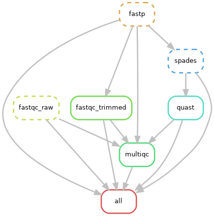

# Dengue Virus Genome Assembly Workflow using Snakemake

## 1. Introduction

This project aimed to assemble the genome of dengue virus from paired-end sequencing reads using a reproducible Snakemake workflow. The sequencing data consisted of Illumina paired-end reads obtained from publicly available sequence data (SRA accession SRR10230796). The workflow was designed to automate preprocessing, genome assembly, and assembly evaluation steps while ensuring reproducibility through conda environments and containerized software.

The analysis pipeline integrates several commonly used bioinformatics tools including FastQC for quality control, fastp for read trimming, SPAdes for genome assembly, QUAST for assembly evaluation, and MultiQC for summarizing quality reports. Snakemake was used to orchestrate the workflow, ensuring that each step is executed in the correct order with well-defined inputs and outputs.
---
## 2. Methods

### Workflow Design
The genome assembly pipeline was implemented using Snakemake to ensure modularity and reproducibility. The workflow consists of the following main steps:

1. Quality control of raw sequencing reads
2. Adapter trimming and quality filtering
3. Quality control of trimmed reads
4. Genome assembly
5. Assembly quality evaluation
6. Aggregated quality reporting

Each step was implemented as an independent Snakemake rule with clearly defined inputs, outputs, and software environments.

### Data Preprocessing

Raw sequencing reads were first evaluated using **FastQC** to assess sequence quality, GC content, adapter contamination, and other quality metrics. 

Next, reads were trimmed using **fastp**, which removes low-quality bases and adapter sequences. The trimming parameters were defined in the configuration file to ensure reproducibility.

After trimming, FastQC was run again to verify improvements in read quality.

### Genome Assembly

Genome assembly was performed using **SPAdes**, a widely used assembler optimized for short-read sequencing data. The trimmed paired-end reads were used as input for SPAdes with the `--careful` parameter enabled to reduce mismatches and short indels in the assembled contigs.

The final assembly output consisted of the file:

results/assembly/scaffolds.fasta

### Assembly Evaluation

Assembly quality was evaluated using **QUAST**, which provides metrics describing assembly contiguity and completeness, including total assembly length, number of contigs, and N50 statistics.

### Workflow Reporting

Finally, **MultiQC** was used to aggregate all quality control outputs (FastQC, fastp, and QUAST reports) into a single interactive HTML report.
---

## 3. Results

### Raw Read Quality

Initial FastQC analysis showed typical Illumina sequencing quality profiles. Some reduction in base quality toward the end of reads was observed, which justified the trimming step.

### Read Trimming

The fastp step successfully removed low-quality bases and adapter contamination. Post-trimming FastQC reports confirmed improved read quality across all base positions.

### Genome Assembly

The genome assembly produced a scaffold file:

results/assembly/scaffolds.fasta

Assembly statistics were generated using QUAST and summarized in:

results/qc/assembly/quast/report.html

Key assembly metrics reported by QUAST include:

- Total assembly length
- Number of contigs
- N50 value
- GC content

These metrics provide insight into the contiguity and overall quality of the assembled genome.

### Quality Control Summary

All quality metrics were aggregated using MultiQC, producing a comprehensive report:

results/qc/multiqc/multiqc_report.html

This report integrates results from FastQC, fastp, and QUAST into a single visualization dashboard.

---

## 4. Discussion

The Snakemake workflow successfully automated the dengue virus genome assembly pipeline from raw sequencing reads to assembly evaluation. The pipeline demonstrates how workflow management systems can ensure reproducibility and modularity in bioinformatics analyses.

Quality control steps confirmed that trimming improved read quality, which is essential for reliable assembly. The SPAdes assembler produced a scaffold-based assembly suitable for downstream analysis. QUAST metrics provided quantitative evaluation of the assembly quality.

One challenge encountered during the workflow development was managing software dependencies across different tools. This was resolved by using conda environments and containerized software through Singularity, ensuring consistent software execution across computing environments.

Future improvements could include adding BUSCO analysis for genome completeness assessment and incorporating assembly visualization tools such as Bandage.

---

## 5. Workflow Visualization

The Snakemake workflow DAG illustrates the dependencies between pipeline steps.

---

## 6. Reproducibility

The workflow can be executed using the following command:

snakemake -s workflow/Snakefile --use-conda --use-singularity --rerun-triggers mtime --cores 4 -p

This command ensures that the appropriate software environments and containers are used during execution.

---

## 7. References

Chen, S., Zhou, Y., Chen, Y., & Gu, J. (2018). fastp: an ultra-fast all-in-one FASTQ preprocessor. *Bioinformatics*, 34(17), i884–i890.

Bankevich, A. et al. (2012). SPAdes: a new genome assembly algorithm and its applications to single-cell sequencing. *Journal of Computational Biology*, 19(5), 455–477.

Gurevich, A. et al. (2013). QUAST: quality assessment tool for genome assemblies. *Bioinformatics*, 29(8), 1072–1075.

Ewels, P. et al. (2016). MultiQC: summarize analysis results for multiple tools and samples in a single report. *Bioinformatics*, 32(19), 3047–3048.

## Note: 
BUSCO was attempted as an assembly completeness assessment step; however, the BUSCO dataset catalog available in the execution environment did not provide a valid dengue virus / flavivirus lineage, and the generic viruses_odb10 lineage is not supported as a root dataset. Therefore, assembly quality assessment was reported using QUAST together with FastQC, fastp, and MultiQC outputs.